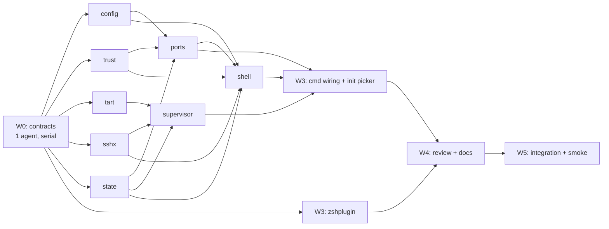

# Plastic Turtle — Implementation Plan

**Companion to:** [`spec.md`](./spec.md)
**Execution model:** parallel Opus 5 subagents working in one shared tree, with disjoint
file ownership per agent and a compile-gated wave structure.
**Environment (verified):** Go 1.26.6 darwin/arm64, `tart` at `/opt/homebrew/bin/tart`,
repo currently contains only `doc/spec.md` and is **not** a git repo.

---

## 0. Prerequisites — **done**

1. ~~`git init`~~ — done (branch `main`, no commits yet, no remote).
2. `go mod init github.com/kenkeiter/plasticturtle` — wave 0.
3. ~~Tart image for the wave-5 smoke test~~ — done:
   `ghcr.io/cirruslabs/macos-tahoe-base:latest` (also present as local image `tahoe-base`).
   **This is the image used in docs, `pt init` examples, and the wave-5 integration test** —
   the spec's `macos-sequoia-base` references are illustrative only.

---

## 1. Spec decisions to lock before coding

These are gaps or internal tensions in `spec.md`. Each has a recommended resolution; the
wave-0 agent bakes the resolution into the interface skeletons so no wave-1 agent has to
guess. Overrule any of these before kickoff — they are cheap now and expensive in wave 3.

| # | Issue | Resolution |
|---|---|---|
| 1 | §6.2 shows the supervisor establishing tunnels, but §8.1.4 requires the *shell* to negotiate ports before spawning it. | Ordering is: shell resolves config → validates mount host paths exist → negotiates/binds host ports interactively → releases probe listeners → writes `instance.json{state:creating, ports:[resolved]}` → spawns supervisor with the resolved port list on **stdin as JSON** (not argv; keeps paths and ports out of `ps` output). Supervisor never prompts. |
| 2 | §7 says mount host paths are validated "at instance start, before cloning" — but cloning happens in the detached supervisor, where errors are invisible. | Validate in `pt shell` **before** spawning the supervisor, and again in the supervisor (defense in depth). User-facing errors must originate from the interactive process. |
| 3 | §8 says the tunnel pipes to `vmIp:<vmPort>` *over the SSH connection*. Dialing the VM's own external IP from inside the VM is wrong for services bound to loopback. | Remote dial target is `127.0.0.1:<vmPort>`; on dial failure fall back once to `vmIp:<vmPort>` and log which one succeeded. |
| 4 | §3.2's PID-reuse guard is specified loosely ("compare start time via sysctl/ps"). | Persist `{pid, startTicks}` in every record. Liveness = `kill(pid,0)` succeeds **and** `KERN_PROC_PID` start time matches. Implement once in `internal/state` (`proc.go`); nothing else may re-implement it. |
| 5 | `pt zsh-hook` and `pt _check-trust` appear in §5.1 but are absent from the §4 CLI surface. | Both are real hidden subcommands; wave 0 registers them. |
| 6 | §4.5 `DISK` via `du -sk`. On APFS, CoW clones share blocks and `du` charges them to whichever path it walks first. | Use `du -sk` as spec'd, but label the column `DISK*` and footnote "approximate; CoW clones share blocks with the source image." Do not invent a smarter accounting scheme in v1. |
| 7 | §7 login preamble "exports `PT_IN_VM_SESSION=1`". `ssh.Session.Setenv` is refused by default `sshd` (`AcceptEnv`). | Do not use `Setenv`. Request PTY, then run the command string: `cd '/Volumes/My Shared Files/project' 2>/dev/null || cd "$HOME"; export PT_IN_VM_SESSION=1; exec "$SHELL" -l`. |
| 8 | Nothing bounds `supervisor.log` growth. | Truncate on supervisor start (one instance = one log lifetime); the file is per-project and short-lived. |
| 9 | Timeouts are scattered through the prose. | Centralize as exported constants in `internal/state` (or a tiny `internal/ptcfg`): boot 120 s, ssh-dial retry backoff 250 ms→2 s, session-poll 2 s, empty-debounce 3 s, heartbeat 5 s, graceful stop 30 s, creating-wait poll 250 ms. Every package references these; no literals. |
| 10 | Clock and process spawning are untestable if used directly. | Wave 0 defines `Clock` and `Runner` (exec) seams. Unit tests inject fakes; `time.Now`/`exec.CommandContext` appear in exactly one file per package. |

---

## 2. Contracts (wave 0 output — the thing that makes parallelism safe)

A single agent writes **compiling, tested-to-`go vet` skeletons** for every package before
any implementation agent starts. Bodies are `panic("TODO(wave1)")`; signatures, structs,
and doc comments are final. This is the interface freeze — wave 1+ agents implement against
it and may not change exported signatures without escalating to the orchestrator.

```
internal/config    Config, Mount, Port structs; Load(dir) (*Config, RawBytes, error);
                   (*Config).Validate() error; Find(startDir) (projectDir string, error);
                   HashBytes(raw []byte) string  // "sha256:<hex>"
internal/trust     Store interface{ Check(path, hash) (bool, error); Allow(path, hash) error;
                   Get(path) (Record, bool, error) }; Open(stateDir) (Store, error)
internal/tart      Client interface{ Clone, Set, Run, Stop, Delete, IP, List };
                   VM struct; RunHandle interface{ Wait() error; Kill() error };
                   NewCLI(Runner) Client; NewFake() *Fake
internal/state     Dir layout helpers; ProjectID(canonicalPath) string;
                   Store interface{ WithLock(fn), WithRLock(fn), ReadInstance, WriteInstance,
                   AddSession, RemoveSession, ListSessions, GC(tart.Client) error };
                   Alive(pid int, startTicks uint64) bool
internal/sshx      Dial(addr, user, pass, Clock) (*Client, error) with retry;
                   (*Client).Interactive(cmd string, term *os.File) (exitCode int, err error);
                   (*Client).Tunnel(ctx, hostAddr, remoteAddr) (io.Closer, error)
internal/ports     Negotiate(cfg []config.Port, interactive bool, io) ([]Resolved, error);
                   Render(w, []Resolved, status) error
internal/supervisor Run(ctx, Params) error        // Params decoded from stdin JSON
internal/shell     Run(ctx, Opts) (exitCode int, error)
internal/zshplugin //go:embed pt.plugin.zsh; Script() string
cmd/pt             cobra root + init/allow/shell/ports/list/_supervise/_check-trust/zsh-hook
```

Also in wave 0: `Makefile` with `make check` = `gofmt -l . && go vet ./... && go build ./... &&
go test ./...`. Every subsequent agent must leave `make check` green — that is the gate.

---

## 3. Wave structure



Waves are barriers: run `make check` and a quick human skim between them. Within a wave,
agents run concurrently and own disjoint directories — no agent edits a file outside its
package, and only the wave-0 and wave-3 agents touch `cmd/pt`.

### Wave 0 — contract freeze (1 agent, serial, ~30 min)

Deliverable: everything in §2, compiling, `go.mod` tidied with the spec's libraries
(`spf13/cobra`, `charmbracelet/huh`, `gofrs/flock`, `golang.org/x/crypto/ssh`,
`golang.org/x/term`, `gopkg.in/yaml.v3`). No behavior. Acceptance: `make check` green with
`panic` bodies untested, `go doc ./internal/...` reads coherently.

### Wave 1 — leaf packages (5 agents, parallel)

| Agent | Package | Deliverable | Acceptance |
|---|---|---|---|
| **A** | `internal/config` | Strict YAML decode (`KnownFields(true)`), all §3.1 validation rules, `~`/relative path expansion, upward project search bounded at `/`, byte-exact hashing. | Table-driven tests covering every validation rule *and its negative case*; `mounts[].name: project` with `host_path` set must error; duplicate `host_port` must error; unknown key must error. |
| **B** | `internal/trust` | `trust.json` load/store, atomic temp+rename under `flock`, path canonicalization at the boundary. | Tests: concurrent `Allow` from N goroutines leaves valid JSON; hash mismatch → not trusted; missing file → not trusted, not an error. |
| **C** | `internal/tart` | Exec wrapper over the real CLI (`--format json` where supported), plus `Fake` with scripted responses and call recording. | Tests drive `Fake`; CLI impl tested by asserting the exact argv produced for each method against a recording `Runner`. |
| **D** | `internal/sshx` | Dial-with-backoff, interactive PTY session (raw mode, `TERM` + window size, `SIGWINCH` forwarding, exit-code propagation), tunnel listener (loopback-only bind, per-conn goroutine, clean `Close`). | Tunnel tested against an in-process `ssh` server from `x/crypto/ssh` (no VM needed) — this is the one non-obvious test and is worth the effort. Interactive session tested for arg construction + raw-mode restore on panic. |
| **E** | `internal/state` | Dir layout, `flock` wrappers with short-hold discipline, instance/session record IO, PID+startTicks liveness (`KERN_PROC_PID` sysctl), full §10 GC including orphaned `pt-*` VM sweep. | Tests: GC removes dead-PID session files; GC force-deletes VMs whose supervisor is dead; GC **never** touches VMs not matching `^pt-[0-9a-f]{16}-[0-9a-f]{8}$`; N-goroutine race registering/removing sessions leaves a consistent dir. |

### Wave 2 — orchestration (3 agents, parallel)

| Agent | Package | Notes |
|---|---|---|
| **F** | `internal/ports` | Probe-bind each `host_port`; on `EADDRINUSE` prompt with default `port+10000` if free else `net.Listen(":0")`; re-prompt on collision; non-TTY → auto-select and print. Renders the `pt ports` table (both scopes). Tests inject an `io.Reader`/`io.Writer` pair and a pre-bound port. |
| **G** | `internal/supervisor` | Decode params from stdin; clone → `set` (only if overridden) → `run` with `--no-graphics --dir=...`; poll `tart ip` + TCP `:22` to 120 s; open tunnels; write `state:running`; then the three concurrent watchers (heartbeat 5 s, session-dir 2 s w/ 3 s empty-debounce, `tart run` child); teardown per §6.3 exactly. Tests run the whole lifecycle against `tart.Fake` + fake clock + a temp state dir, asserting the state sequence `creating→running→stopping→dead` and that teardown is idempotent under a mid-flight child exit. |
| **H** | `internal/shell` | Resolve project → verify trust → GC → lock → decide create/attach → (create path: validate mounts, negotiate ports, write record, spawn detached `Setsid` supervisor with stdio to `supervisor.log`) → (attach path: release lock, poll for `running` with spinner + 120 s timeout, print the config-drift note when `configHash` differs) → register session → SSH interactive → deregister under lock → mirror exit code. Tests cover both paths plus the "supervisor died during creating" and "state == stopping → wait for dead, then recreate" branches. |

### Wave 3 — surface (2 agents, parallel)

| Agent | Scope |
|---|---|
| **I** | `cmd/pt`: wire every subcommand, `--json` for `list`/`ports`, `-v/--verbose`, exit codes (incl. `_check-trust`'s 0/10/1); `pt init` interactive flow with the `huh` image picker fed by `tart list --format json` + free-text OCI entry, port prompts, commented-YAML emission, auto-allow; `pt list` column assembly (`ps` for CPU/RSS over the `tart run` tree, `du -sk`, uptime). |
| **J** | `internal/zshplugin`: `pt.plugin.zsh` (`chpwd` + `precmd`, bounded upward walk, no-op if `pt` absent, `PT_PROMPT` prefix, green/yellow), embedded and printed by `pt zsh-hook`. Must include a measured note that `pt _check-trust` stays under 10 ms — benchmark it. |

### Wave 4 — hardening (2 agents, parallel)

| Agent | Scope |
|---|---|
| **K** | Adversarial review of waves 1–3 against the spec, section by section: every MUST in §§3–10 mapped to the code that implements it and the test that covers it. Output a gap list, not edits. |
| **L** | `README.md`: install, `pt init` walkthrough, the Linux-guest mount caveat (§7), `PT_SSH_USER`/`PT_SSH_PASSWORD` escape hatch, security model (why `InsecureIgnoreHostKey` is acceptable here), troubleshooting via `supervisor.log`. |

### Wave 5 — reality check (serial, 1 agent + human)

`//go:build integration` test that clones a real image, boots, forwards a port, opens a
session, exits, and asserts the clone is gone. Then a manual smoke pass: two concurrent
`pt shell`s sharing one VM, `pt list` mid-session, `pt ports` with a deliberate host-port
collision, `kill -9` the supervisor and confirm the next `pt shell` recovers cleanly.

**This wave is where the design gets falsified.** Budget real time for it; the first four
waves are all testable against fakes and will feel deceptively finished.

---

## 4. Agent execution mechanics

- **Model/effort:** Opus 5 for every wave. High effort for waves 0, 2, 4 (contract design,
  concurrency, review); default effort is sufficient for waves 1, 3, 5.
- **Isolation:** shared working tree, *not* worktrees. Package ownership is already disjoint,
  and worktree-per-agent adds merge cost for no conflict avoided. The one rule: an agent that
  believes it needs to edit outside its package must stop and report instead.
- **Prompt template** (per agent): spec section references it must satisfy → the frozen
  interface it implements → its exclusive file list → "leave `make check` green" → "write
  tests in the same commit" → "report any spec ambiguity rather than resolving it silently."
- **Between waves:** orchestrator runs `make check`, reads the diff, and resolves anything
  escalated before releasing the next wave.
- **Do not** run waves 1 and 2 concurrently. The temptation is real — wave 2's agents will
  compile against wave 1's skeletons — but they cannot be meaningfully tested against
  `panic()` bodies, and debugging that is more expensive than the barrier.

---

## 5. Risks

| Risk | Mitigation |
|---|---|
| ~~Tart image pull gates all real verification.~~ | Resolved — `macos-tahoe-base` is pulled. |
| The supervisor is the only genuinely concurrent component; races there are the most likely source of production bugs. | Fake clock + deterministic lifecycle tests in wave 2; `go test -race` in `make check`. |
| `crypto/ssh` interactive PTY handling (raw mode, resize, exit codes) is fiddly and only fully exercised against a real VM. | Wave 1D builds against an in-process SSH server; wave 5 confirms against the real thing. |
| Spec §12 forbids revisiting six decisions; agents may "improve" them anyway. | State the frozen decisions verbatim in every agent prompt. |
| `pt shell`'s create path holds user attention through port negotiation *and* a 120 s boot. | Ensure the spinner and prompts are on the interactive process only; supervisor stdio goes to the log, never the terminal. |

---

## 6. Definition of done

`make check` green; every §§3–10 MUST traced to an implementation and a test (wave 4K's
matrix); the wave 5 manual pass completes without leftover `pt-*` VMs in `tart list` or
stale directories under `~/.local/state/plasticturtle/instances/`.
