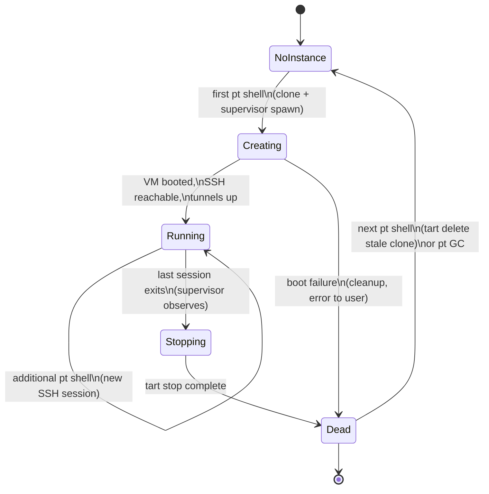

# Plastic Turtle — Design Document

**Status:** Draft for implementation
**Language:** Go
**Platform:** macOS (Apple Silicon) — Tart is macOS-only
**External dependencies:** [Tart](https://tart.run) CLI, zsh (for the shell plugin)

---

## 1. Overview

Plastic Turtle (`pt`) manages ephemeral [Tart](https://tart.run) VM instances that sandbox
project directories — primarily for projects in which LLM agents will be run. A project opts
in via a `.plasticturtle` YAML config; `pt shell` transparently clones, boots, and SSHes into
a VM with the project directory mounted, and tears everything down when the last shell exits.

### Design principles

1. **No daemon.** Coordination happens through state files on disk plus detached child
   processes. Any `pt` invocation must be able to reconstruct the world from the state
   directory alone.
2. **Ephemeral VMs.** Every "session group" (the span from the first `pt shell` to the last
   one exiting) runs on a fresh CoW clone. Nothing inside the VM survives except what is
   written to mapped host directories.
3. **Explicit trust.** A `.plasticturtle` file is inert until the user runs `pt allow`,
   and must be re-allowed whenever its content changes. This prevents a cloned repo (or an
   LLM editing the config) from silently changing VM images, mounts, or port mappings.
4. **Shared instances.** Concurrent `pt shell` invocations for the same project attach to
   the same running VM via additional SSH sessions.

---

## 2. Key concepts and terminology

| Term | Meaning |
|---|---|
| **Project** | A directory containing a `.plasticturtle` file. Identified by the *canonical absolute path* of that directory (symlinks resolved). |
| **Project ID** | `sha256(canonical project path)`, hex, truncated to 16 chars. Used to key state on disk and to name VM clones. |
| **Instance** | One ephemeral VM clone serving one session group. Named `pt-<project-id>-<8-char-random-suffix>`. |
| **Session** | One `pt shell` terminal attached to an instance. |
| **Session group** | All sessions sharing one instance. When the group empties, the instance is stopped and marked for deletion. |
| **Supervisor** | A detached `pt` helper process (hidden subcommand) that owns the `tart run` child, SSH tunnels, and end-of-life cleanup for one instance. It is *not* a daemon: it lives exactly as long as its instance. |

---

## 3. On-disk layout

### 3.1 Per-project config: `<project>/.plasticturtle`

```yaml
# .plasticturtle — checked into the repo, human-edited
version: 1

# Required. Tart image to clone (local image name or OCI reference).
image: ghcr.io/cirruslabs/macos-sequoia-base:latest

# Optional. Override resources inherited from the image.
resources:
  cpu: 8          # vCPUs
  memory: 8192    # MiB

# Optional. Port forwards, VM -> host. host_port may be omitted (=vm_port).
ports:
  - vm_port: 3000
    host_port: 3000
  - vm_port: 5432          # host_port defaults to 5432

# Optional. Extra/overriding directory mappings.
# The project directory itself is ALWAYS mapped, read-write by default,
# at guest path /Volumes/My Shared Files/project (see §7). Its mode can be
# overridden with the reserved name "project".
mounts:
  - name: project          # reserved: overrides the implicit project mount
    mode: ro               # rw (default) | ro
  - name: datasets
    host_path: ~/datasets  # ~ expanded relative to the invoking user
    mode: ro
  - name: scratch
    host_path: ./scratch   # relative paths resolved against the project dir
    mode: rw
```

Validation rules (enforced on `pt allow` and again on every load):

- `version` must equal `1`.
- `image` is required, non-empty.
- `resources.cpu` ≥ 1; `resources.memory` ≥ 512 if present.
- `vm_port`/`host_port` in `1..65535`; duplicate `host_port`s within one config are an error.
- `mounts[].name` must match `[a-zA-Z0-9_-]+`, be unique, and `host_path` is required for
  every mount except the reserved `project` entry (where it is forbidden).
- Unknown top-level or nested keys are an error (strict decoding) — silent typos in a
  security-relevant file are worse than friction.

### 3.2 User-level state: `~/.local/state/plasticturtle/`

```
~/.local/state/plasticturtle/
├── trust.json                     # pt allow database (see §5)
└── instances/
    └── <project-id>/
        ├── lock                   # flock() file guarding this project's state
        ├── instance.json          # current instance record (see below)
        └── sessions/
            └── <session-id>.json  # one file per live pt shell
```

`instance.json`:

```json
{
  "instanceName": "pt-1a2b3c4d5e6f7a8b-9f3d2c1a",
  "projectPath": "/Users/alice/code/myproj",
  "configHash": "sha256:...",
  "state": "running",              // creating | running | stopping | dead
  "supervisorPid": 12345,
  "vmIp": "192.168.64.5",
  "createdAt": "2026-08-18T09:00:00Z",
  "ports": [
    {"vmPort": 3000, "hostPort": 3000},
    {"vmPort": 5432, "hostPort": 15432}   // reflects any runtime remapping (§8)
  ]
}
```

`sessions/<session-id>.json`:

```json
{"pid": 23456, "startedAt": "2026-08-18T09:01:00Z", "tty": "/dev/ttys004"}
```

**PID liveness rule:** any reader of `supervisorPid` or session `pid` values must verify the
process is alive (`kill(pid, 0)`; additionally compare process start time via
`sysctl`/`ps` to guard against PID reuse). Records for dead PIDs are stale and are
garbage-collected under the project lock (§10).

### 3.3 Locking

All mutations of a project's state directory happen while holding an exclusive `flock` on
`instances/<project-id>/lock`. Reads that only display status (`pt list`, `pt ports`) take a
shared lock. Lock hold times must be short — never hold the lock while waiting for a VM to
boot; instead write `state: creating` and release (§6.2).

---

## 4. CLI surface

```
pt init [<path>]        Interactive project setup; writes .plasticturtle and auto-allows it
pt allow [<path>]       Trust the current content of .plasticturtle
pt shell [<path>]       Enter (creating if needed) the project VM
pt ports [--global]     Show configured forwards and live status
pt list                 Show all active instances with resource usage
pt _supervise <args>    Hidden: instance supervisor (never run by users)
```

`<path>` always defaults to the current working directory. For every command except `init`,
`pt` resolves the project by walking from `<path>` upward until a `.plasticturtle` is found
(like `git`), so `pt shell` works from subdirectories.

Global flags: `--json` (machine-readable output for `list`/`ports`), `-v/--verbose`.

### 4.1 `pt init`

1. If `.plasticturtle` already exists at the target: refuse, suggest editing + `pt allow`.
2. Run `tart list --format json` (source `local` and cached OCI images) and present an
   interactive picker (use `charmbracelet/huh` or similar) of available images. Also allow
   free-text entry of an OCI reference.
3. Prompt (optional, repeatable) for port mappings `vm_port[:host_port]`.
4. Write `.plasticturtle` with the selections and helpful comments.
5. Automatically record trust (equivalent to `pt allow`) — the user just authored the file.

### 4.2 `pt allow`

1. Read `.plasticturtle`, run full validation (§3.1). Print validation errors and exit
   non-zero on failure — invalid configs cannot be trusted.
2. If the file is byte-identical to what is already allowed, say so and exit `0` without
   prompting. There is nothing to approve, and re-prompting trains the reflex this whole
   command depends on not existing.
3. Otherwise print what is being trusted and require a `y/N` confirmation. This is the
   security choke point; make the user actually see what the file does.
   - First approval, or a record with no snapshot (§5): the full summary — image, resource
     overrides, every mount with mode, every port, the network policy and its allowlist.
   - Re-approval with a snapshot available: only the grants that changed, as `+` added,
     `-` removed, `~` value changed. The full summary was read at the first approval; the
     risk of a re-approval is its delta, which a reprinted wall of approved text buries.
   - An edit that changes no grant (comments, ordering, whitespace) says so explicitly and
     still prompts, since trust is keyed on bytes.
4. Store `{canonicalProjectPath: {hash, allowedAt, raw}}` in `trust.json` (see §5).

### 4.3 `pt shell`

See §6 for the full flow.

### 4.4 `pt ports [--global]`

Without `--global`: for the current project, print a table of `VM PORT | HOST PORT | STATUS`.
Status values:

- `forwarding` — instance running and the tunnel listener is up (supervisor heartbeat, §6.3).
- `remapped from <n>` annotation when runtime remapping occurred.
- `inactive` — project has no running instance.

With `--global`: iterate all `instances/*/instance.json` with live supervisors and print the
same table grouped by project path. Also detect and flag host-port collisions *between*
projects.

### 4.5 `pt list`

For each live instance:

| Column | Source |
|---|---|
| PROJECT | `instance.json.projectPath` |
| VM | `instanceName` |
| STATE | `instance.json.state` (after PID-liveness check) |
| SESSIONS | count of live session files |
| CPU % | sum of `%cpu` from `ps` for the `tart run` process tree |
| MEM | RSS from `ps` for the same tree |
| DISK | `du -sk` of `~/.tart/vms/<instanceName>` (report *actual* usage — CoW clones start near zero) |
| UPTIME | now − `createdAt` |

---

## 5. Trust model (`pt allow`)

`trust.json` maps canonical project path → SHA-256 of the exact bytes of `.plasticturtle`:

```json
{
  "/Users/alice/code/myproj": {
    "hash": "sha256:ab12...",
    "allowedAt": "2026-08-18T08:59:00Z",
    "raw": "<base64 of the approved file>"
  }
}
```

- `raw` is a snapshot of the bytes that were approved, kept so `pt allow` can show what
  changed rather than what the file says (§4.2). It is advisory and never authoritative:
  `hash` alone decides trust. It is omitted for records written before this field existed
  and for files above the snapshot cap, and every consumer must handle its absence by
  falling back to the full summary. A snapshot that does not hash to `hash` is rejected at
  write time — diffing against bytes nobody approved would be worse than not diffing.
- `pt shell` (and any config load) recomputes the hash and compares. Mismatch or absence →
  hard error: `".plasticturtle has changed (or was never allowed). Review it, then run: pt allow"`.
- Trust is keyed by *path*, so moving a project requires re-allowing (acceptable; cheap).
- `trust.json` writes are atomic (write temp file + `rename`) under an `flock` on the file.

### 5.1 zsh plugin

Shipped as `pt.plugin.zsh`; `pt init`'s first-run experience (or the install docs) instructs
the user to add `source <(pt zsh-hook)` — a hidden subcommand that prints the plugin — to
`.zshrc`.

Behavior, implemented with a `chpwd` hook:

1. On directory change, walk upward for `.plasticturtle` (bounded at `$HOME` and `/`).
2. If found, run `pt _check-trust <dir>` (hidden, fast, no locks: hash file + read
   `trust.json`). Exit codes: `0` trusted, `10` changed/untrusted, `1` error.
3. If untrusted, print a yellow one-line warning:
   `⚠️  .plasticturtle is not allowed (new or changed). Run 'pt allow' before 'pt shell'.`
4. The hook must never block noticeably: `pt _check-trust` should complete in <10 ms and the
   plugin should no-op silently if `pt` is not on `PATH`.
5. Additionally, `pt shell` itself exports `PT_IN_VM_SESSION=1` into the SSH session's
   environment where possible so nested tooling can detect it (best-effort; see §7).

---

## 6. Instance lifecycle

### 6.1 State machine



An instance in `dead` state still has its clone on disk; deletion is deferred to the next
`pt shell` (per spec) — but the supervisor also *attempts* deletion itself during teardown
(§6.3 step 6) as an optimization. The deferred path is the correctness backstop for crashes.

### 6.2 `pt shell` flow

```mermaid
sequenceDiagram
    participant U as pt shell (terminal)
    participant S as pt _supervise (detached)
    participant T as tart / VM

    U->>U: resolve project, verify trust (§5)
    U->>U: flock project lock
    alt no live instance
        U->>U: GC stale state; tart delete old dead clone if present
        U->>U: write instance.json {state: creating}, pick instance name
        U->>S: spawn detached supervisor (setsid, stdio→log file)
        U->>U: release lock
        S->>T: tart clone <image> <instanceName>
        S->>T: tart set --cpu/--memory (only if overridden in config)
        S->>T: tart run --no-graphics --dir=... (child process)
        S->>T: poll tart ip + TCP dial :22 until ready (timeout 120 s)
        S->>S: start SSH port-forward listeners (§8)
        S->>S: update instance.json {state: running, vmIp, supervisorPid}
    else instance exists (creating or running)
        U->>U: release lock, wait for state=running (poll, timeout)
    end
    U->>U: register sessions/<id>.json (under lock)
    U->>T: interactive SSH session (crypto/ssh, admin/admin, PTY)
    T-->>U: session ends (exit / EOF / VM died)
    U->>U: remove session file (under lock)
    Note over S: supervisor polls session dir;\nwhen empty → teardown (§6.3)
```

Notes:

- **Config is snapshotted at instance creation.** The supervisor embeds the parsed config;
  later edits to `.plasticturtle` (even re-allowed ones) apply only to the *next* instance.
  If `pt shell` finds a live instance whose `configHash` differs from the currently allowed
  hash, it attaches anyway but prints:
  `note: config changed since this VM started; changes apply after all shells exit.`
- **Waiting for `creating`:** subsequent shells poll `instance.json` every 250 ms with the
  same 120 s timeout, showing a spinner ("waiting for VM to boot…").
- The user's shell inside the VM is whatever the image's default login shell is; `pt` does
  not try to replicate the host environment.

### 6.3 Supervisor (`pt _supervise`)

Spawned via `exec.Command` on the `pt` binary itself with `Setsid: true`, stdout/stderr
redirected to `instances/<project-id>/supervisor.log`. Responsibilities:

1. Clone, configure, and run the VM (`tart run` as a direct child; keep the handle).
2. Establish port forwards (§8) over a dedicated SSH connection.
3. Touch a `heartbeat` mtime file every 5 s (lets `pt ports`/`pt list` distinguish a healthy
   supervisor from a zombie without signals).
4. **Watch sessions:** every 2 s, list `sessions/*.json`, filtering dead PIDs. When the set
   has been empty for a 3 s debounce (to tolerate `exit && pt shell` re-entry), begin teardown.
5. **Watch the VM:** if the `tart run` child exits unexpectedly, mark `state: dead`,
   close tunnels, and exit. Attached `pt shell` sessions will see their SSH drop and print
   `VM terminated unexpectedly; see supervisor.log`.
6. **Teardown:** set `state: stopping`; close tunnel listeners; `tart stop <instance>`
   (graceful, 30 s timeout) then `tart stop --force`; set `state: dead`; best-effort
   `tart delete <instance>`; remove state files if delete succeeded; exit.
7. Handle `SIGTERM` as "tear down now" (used by future `pt stop`, not in v1 scope).

Crash-safety: if the supervisor itself dies, the next `pt shell` finds `supervisorPid` dead
under the lock, force-stops/deletes any leftover `tart` VM by name, clears state, and
proceeds as `NoInstance`.

---

## 7. Directory mapping

- Implemented with Tart's virtiofs sharing: `tart run --dir=<name>:<hostPath>[:ro]`.
- The **project directory is always mapped** as `--dir=project:<projectPath>` (mode from the
  reserved `project` mount entry, default `rw`).
- Additional mounts come straight from `mounts[]`, `ro` appended for `mode: ro`.
- Guest-side location is determined by the guest OS: on macOS guests, shares appear under
  `/Volumes/My Shared Files/<name>`; on Linux guests they must be mounted
  (`mount -t virtiofs com.apple.virtio-fs.automount <mountpoint>`). v1 targets macOS guests;
  document the Linux caveat in the README and print a hint if SSH login banner detection
  suggests Linux (best-effort, non-blocking).
- After the SSH session opens, `pt shell` runs a short login preamble (before handing the
  PTY to the user): `cd "/Volumes/My Shared Files/project" 2>/dev/null; export PT_IN_VM_SESSION=1`
  then execs the user's shell — so users land in their project. If the path doesn't exist
  (non-macOS guest), land in `$HOME`.
- Host paths are validated to exist at instance start; a missing mount source is a hard
  error before cloning.

---

## 8. Port forwarding

- Forwards are **SSH local forwards implemented in the supervisor** with `golang.org/x/crypto/ssh`:
  for each mapping, the supervisor listens on `127.0.0.1:<hostPort>` and pipes each accepted
  connection to `vmIp:<vmPort>` over its SSH client connection. No `ssh` binary, no extra
  processes, tunnels die with the supervisor by construction.
- Listeners bind loopback only (sandboxing tool; don't expose the VM to the LAN).

### 8.1 Host-port conflicts

At tunnel setup, for each configured `host_port`:

1. Try to bind. On success, done.
2. On `EADDRINUSE`, the *initiating* `pt shell` (which is still attached and interactive
   during `creating`) prompts:

   ```
   Port 5432 is in use on the host.
   Forward VM port 5432 to host port [15432]:
   ```

   The default (shown in brackets, accepted on Enter) is an automatically selected free
   port: prefer `hostPort + 10000` if free, else an ephemeral port from `net.Listen(":0")`.
   The user may type any port; re-prompt if that one is also taken.
3. The chosen remapping is written into `instance.json.ports` (annotated as remapped) for
   `pt ports` to display. It is **not** written back to `.plasticturtle` (that would
   invalidate trust); it lives only for the instance's lifetime.
4. Mechanically, the supervisor cannot prompt (it is detached); so the initiating `pt shell`
   performs the port *binding negotiation* itself before spawning the supervisor, and passes
   the final resolved port list to the supervisor via its command line/JSON on stdin. The
   shell releases its probe listeners immediately before spawn; the supervisor re-binds
   (tiny race, retried once with re-prompt as fallback).
5. Non-interactive contexts (no TTY): skip the prompt, take the automatic port, print it.

---

## 9. SSH details

- Credentials: `admin` / `admin` (Tart image convention), hardcoded default; env overrides
  `PT_SSH_USER` / `PT_SSH_PASSWORD` as an escape hatch (documented, not in config —
  keeping secrets out of `.plasticturtle`).
- Library: `golang.org/x/crypto/ssh` for both interactive sessions and tunnels.
- Interactive session: request a PTY mirroring the host terminal (size + `TERM`), forward
  `SIGWINCH` for resizes, put the local terminal in raw mode (`golang.org/x/term`),
  restore on exit. Exit code of `pt shell` mirrors the remote shell's exit status.
- `HostKeyCallback: ssh.InsecureIgnoreHostKey()` — acceptable: ephemeral VMs on a local
  virtio network; note the rationale in code comments.
- Connection retry/backoff on the boot path only; once established, a dropped session is
  reported, not retried.

---

## 10. Garbage collection & edge cases

Run opportunistically at the start of `pt shell`, `pt list`, `pt ports` (under project lock;
`list`/`ports` do a global pass):

- **Dead session files** (PID gone): delete.
- **Dead supervisor** with `state != dead`: force `tart stop --force` + `tart delete` on the
  named instance if `tart list` still shows it; delete state dir.
- **Orphaned tart VMs**: any VM named `pt-*` with no corresponding state dir → delete
  (only names matching our exact pattern; never touch other Tart VMs).
- **`pt shell` re-entry during `stopping`:** wait for `dead` (supervisor exits fast), then
  proceed with a fresh instance.
- **Host sleep/reboot:** after reboot, everything is dead PIDs; GC handles it.
- **`.plasticturtle` deleted while instance runs:** existing sessions unaffected (config was
  snapshotted); new `pt shell` fails with "no .plasticturtle found".
- **Same project via different symlinked paths:** canonicalization (§2) makes them one project.

---

## 11. Code organization

```
plasticturtle/
├── cmd/pt/main.go            # cobra root; subcommand wiring
├── internal/
│   ├── config/               # .plasticturtle parsing + strict validation
│   ├── trust/                # trust.json store (hashing, atomic writes)
│   ├── state/                # state dir, instance/session records, flock, GC
│   ├── tart/                 # thin exec wrapper: clone/run/stop/delete/ip/list/set
│   │                         #   (parse `--format json` where available)
│   ├── sshx/                 # crypto/ssh helpers: interactive PTY session, tunnels
│   ├── supervisor/           # pt _supervise implementation
│   ├── shell/                # pt shell orchestration
│   ├── ports/                # conflict probing, prompting, pt ports rendering
│   └── zshplugin/            # embedded pt.plugin.zsh + _check-trust
├── go.mod
└── README.md
```

Suggested libraries: `spf13/cobra` (CLI), `charmbracelet/huh` (init picker),
`gofrs/flock`, `golang.org/x/crypto/ssh`, `golang.org/x/term`, `gopkg.in/yaml.v3`
(with `KnownFields(true)` for strict decoding).

### Testing strategy

- `tart` interactions behind an interface; unit-test lifecycle logic against a fake.
- Table-driven tests for config validation and trust hashing.
- One opt-in integration test (`//go:build integration`) that exercises a real Tart image
  end-to-end on a Mac runner.
- Concurrency tests: N goroutines racing `pt shell` state registration against a fake tart.

---

## 12. Decisions already made (do not revisit)

| Question | Decision |
|---|---|
| VM persistence | Fully ephemeral; fresh clone per session group; concurrent shells share the instance |
| Project dir mapping | Always mapped, RW by default; overridable + extra mounts via `mounts[]` |
| SSH auth | Tart default `admin`/`admin` (env-var escape hatch) |
| Coordination | No daemon; state files + detached processes |
| Host-port conflict | Interactive prompt with auto-selected free port as the default answer |
| Resources | Inherit from image; per-project override in `.plasticturtle` |

## 13. Assumptions made in this doc (flag to the user if wrong)

1. State lives in `~/.local/state/plasticturtle/`; trust DB alongside it (not `~/.config`).
2. `pt init` auto-allows the config it just wrote.
3. Deferred deletion of dead clones is a backstop; the supervisor also deletes eagerly on
   clean teardown.
4. Tunnels bind `127.0.0.1` only.
5. Runtime port remaps are never written back to `.plasticturtle`.
6. v1 targets macOS guest images; Linux guests work for shell/ports but directory-share
   auto-mounting is documented as manual.
7. `pt shell` from a subdirectory resolves upward to the nearest `.plasticturtle`.